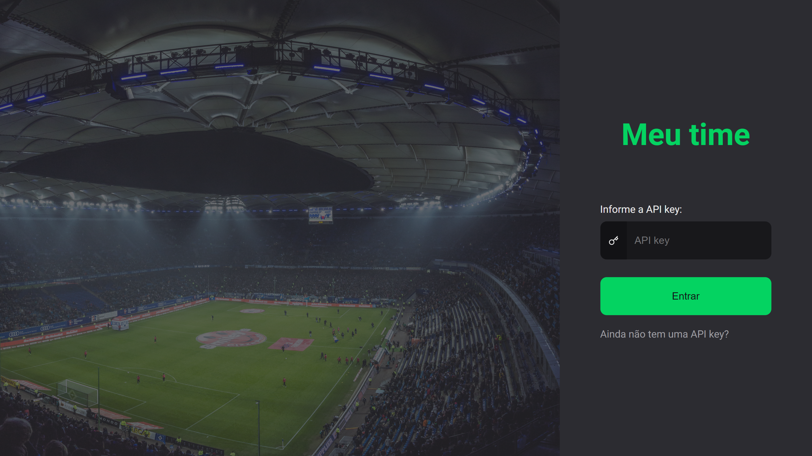
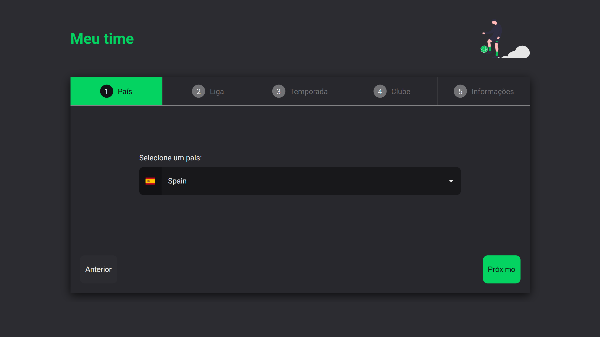
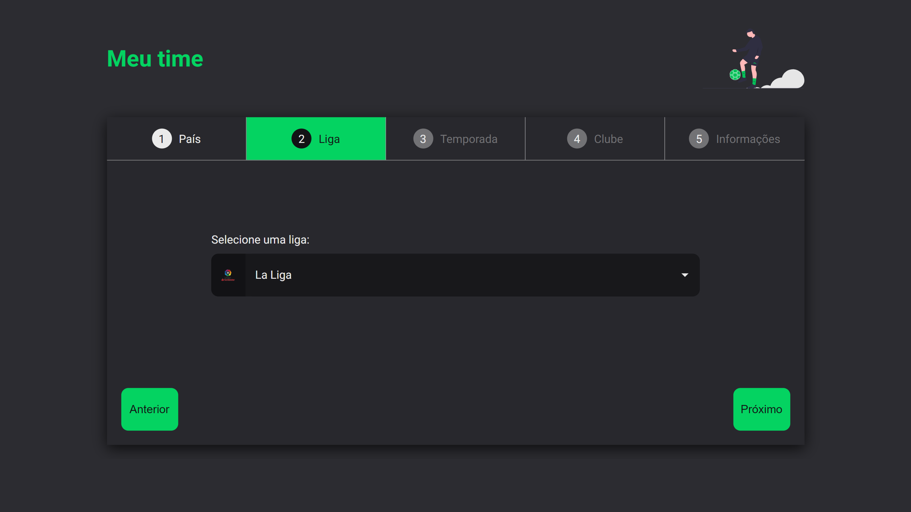
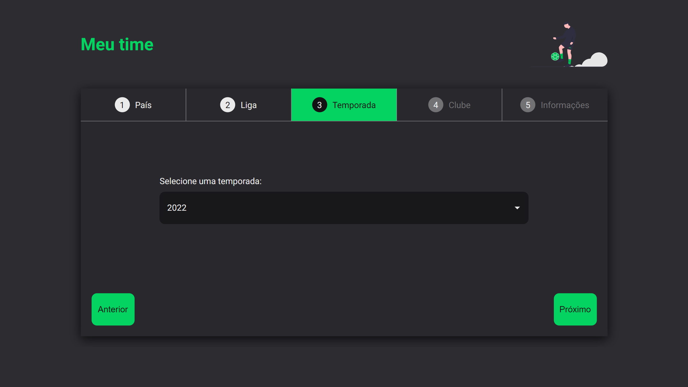
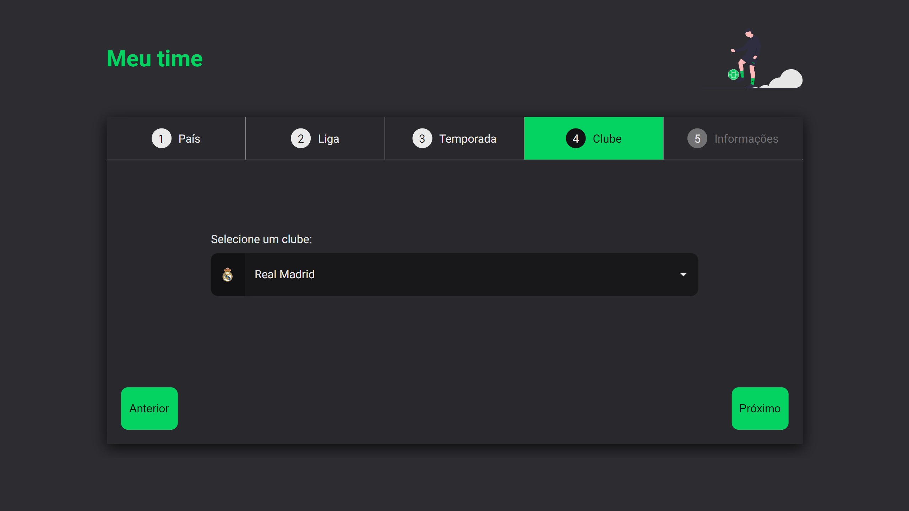
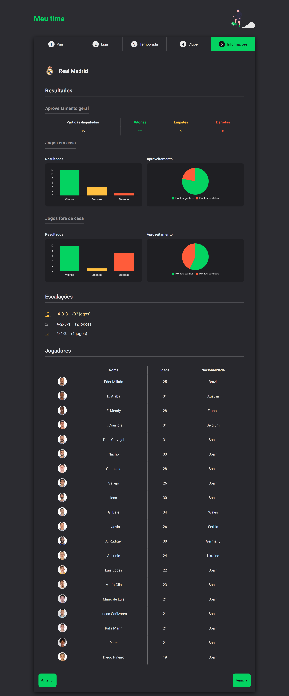

<h1 align="center"> Meu Time  </h1>

<p align="center">
`Meu Time` is an application for accessing soccer statistical data via <a href="https://www.api-football.com/" target="_blank">API-Football</a>. <br/>
</p>

<p align="center">
  <a href="#live">Live</a>&nbsp;&nbsp;&nbsp;|&nbsp;&nbsp;&nbsp;
  <a href="#technologies">Technologies</a>&nbsp;&nbsp;&nbsp;|&nbsp;&nbsp;&nbsp;
  <a href="#layout">Layout</a>&nbsp;&nbsp;&nbsp;|&nbsp;&nbsp;&nbsp;
  <a href="#gettingStarted">Getting Started</a>&nbsp;&nbsp;&nbsp;|&nbsp;&nbsp;&nbsp;
  <a href="#prints">Prints</a>&nbsp;&nbsp;&nbsp;|&nbsp;&nbsp;&nbsp;
  <a href="#license">License</a>
</p>

<p align="center">
  
</p>

<p align="center">
  
</p>

<h2 id="live">👁️‍🗨️ Live</h2>

This project is hosted at Github Pages of this repository by the link <a href="https://leonardojacomussi.github.io/rocketmovies/" target="_blank">https://leonardojacomussi.github.io/rocketmovies/</a>

<h2 id="technologies">🚀 Technologies</h2>

This project was developed with the following technologies:

- React JS
- Next JS
- Typescript
- Styled Components
- Git and Github
- Figma

<h2 id="layout">🔖 Layout</h2>

You can view the project layout through [THIS LINK](https://www.figma.com/file/bhRb4iFUkfRFlDm9Yd5uk5/RocketMovies-(Copy)). You must have a [Figma](https://figma.com) account to access it.

<h2 id="gettingStarted">👨🏽‍💻 Getting Started</h2>

First, install the dependencies:

```bash
npm install
```

Second, run the development server:

```bash
npm run dev
```

Open [http://localhost:3000](http://localhost:3000) with your browser to see the result.

<h2 id="prints">📷 Prints</h2>

<p align="center">
  
</p>
<p align="center">
  
</p>
<p align="center">
  
</p>
<p align="center">
  
</p>
<p align="center">
  
</p>

<h2 id="license">📜 License</h2>

This project is under the MIT license.
